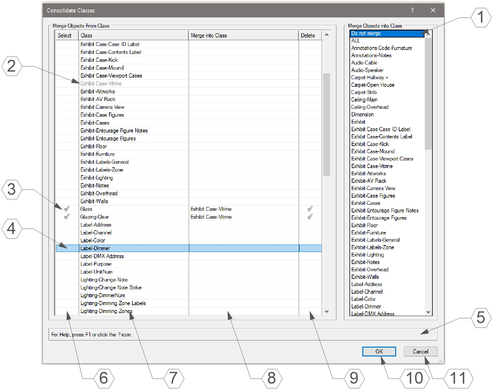

# Consolidate Classes

Menu Command

## Version

1.0.0 - 11/06/2023

This plug-in is written in Vectorscript (Pascal) and can be used in any version of [Vectorworks](https://www.vectorworks.net/) 2019 or newer.

## Description

Opens a dialog box allowing user to merge all objects in one Class to another existing Class with an option to delete the original Class after the operation.

## Instructions

1. Run the **Consolidate Classes** menu command.
2. In the **Merge Objects From Class** List Browser on the left, select an existing Class to merge objects *from*. Only one Class may be selected at a time.
3. In the **Merge Objects Into Class** List Box on the right, select a new Class for the objects to be merged into.
4. Put a check in the **Delete** column to delete the original class after the operation has been completed.
5. Selecting a Class in the List Browser on the left will remove that Class from the List Browser on the right and vice versa.

## Dialog Box Explanation

1. List Box highlighting the *Merge Into Class* for the currently selected *Merge From Class*. If **Do not merge** is selected, the *Merge From Class* will be ignored.
2. Classes selected from the *Merge Objects into Class* box will be shown in Gray and cannot be selected.
3. Objects in Classes containing a checkmark in the **Select** column will be merged into Classes listed in the **Merge Into Class** column.
4. The currently selected Class will be highlighted in the List Browser. Only one Class may be selected at a time.
5. **Help Box**, mousing over any dialog box element will display an explanation of the element here.
6. Column displaying a checkmark when objects from Class are set to be merged into another Class.
7. Column listing possible Classes to merge from.
8. Column listing current Class for objects to merge into.
9. Place a checkmark in this column to delete the Class after merge operation.
10. Pressing the **OK** button will close the dialog box and execute the merge operation, deleting any Classes with a checkmark in the **Delete** column.
11. Pressing the **Cancel** button will close the dialog box without merging or deleting any Classes.

## Installation Instructions

There are two methods of installation, direct download of the plug-in or through the **JNC Tools Free Manager** plug-in.

### Direct Download:

1. Download [source plug-in file](Consolidate%20Classes.vsm)
2. Place downloaded file inside the **Vectorworks User Folder** within the **Plug-ins** directory
3. Restart Vectorworks

### JNC Tools Free Manager

1. Run the [**JNC Tools Free Manager**](https://jncogs.github.io/JNC-Tools-Manager-Free/) menu command
2. Select the **Consolidate Classes** command
3. Press the **Install / Update** button
4. Press **Close** to close the dialog box
5. Restart Vectorworks

## Adding the Plug-in to your Workspace

1. Open the **Workspace Editor** by going to **Tools - Workspaces - Edit Current Workspace**
2. Select the **Menus** tab
3. In the box on the left, find and expand the **JNC** category
4. In the box on the right, find a suitable menu to place the command in, such as **Tools** or **Modify**
5. Click and drag the **Consolidate Classes** command from the box on the left to the desired menu location in the box on the right
6. Click **OK** to close the editor

## Localization Instructions

The plug-in can be localized to your native language without having access to the source code.  This can be achieved by following the instructions below:

1. Open the **Plug-in Manager** by going to **Tools - Plug-ins - Plug-in Manager**
2. Select the **Third-party Plug-ins** tab
3. Select the **Consolidate Classes** command
4. Click the **Customize** button
5. Select the **Strings** tab
6. Double-click a category, such as **Dialog Strings**
7. Select a string to edit and press the **Edit** button
8. Write a new string and press the **OK** button until you are back to the **Plug-in Manager**

The categories for this plug-in are as follows:

- **3000** - *Dialog Strings*: These strings are used in the dialog box and can all freely be changed.
- **4000** - *Dialog Help Strings*: These strings are used in the Help Box at the bottom of the dialog box and can all be freely changed.
- **5000** - *Misc Strings*: These strings serve multiple purposes in the code, only strings **5000** and **5001** can be changed to match the localized names of the *None* and *Dimension* Classes.

## Release Notes

| Date | Version | Note |
| :---: | :---: | :--- |
| 11/06/2023 | 1.0.0 | Initial release |
| 09/02/2024 | 1.0.1 | Added Help Box to dialog |
| - | - | Made dialog box resizable |

## Known Bugs

No Known Bugs

## Feature Requests

No current Feature Requests

## License

Copyright (c) Jesse Cogswell (JNC Tools)

Permission is hereby granted, free of charge, to any person or organization
obtaining a copy of this software (the "User") and associated documentation files (the "Software"),
to use, reproduce, distribute, execute, and transmit the Software.

The User is not permitted to modify or attempt to reverse engineer the source code.  The User may
localize the Software using approved methods from within the Vectorworks software.

THE SOFTWARE IS PROVIDED "AS IS", WITHOUT WARRANTY OF ANY KIND, EXPRESS OR
IMPLIED, INCLUDING BUT NOT LIMITED TO THE WARRANTIES OF MERCHANTABILITY,
FITNESS FOR A PARTICULAR PURPOSE, TITLE AND NON-INFRINGEMENT. IN NO EVENT
SHALL THE COPYRIGHT HOLDERS OR ANYONE DISTRIBUTING THE SOFTWARE BE LIABLE
FOR ANY DAMAGES OR OTHER LIABILITY, WHETHER IN CONTRACT, TORT OR OTHERWISE,
ARISING FROM, OUT OF OR IN CONNECTION WITH THE SOFTWARE OR THE USE OR OTHER
DEALINGS IN THE SOFTWARE.